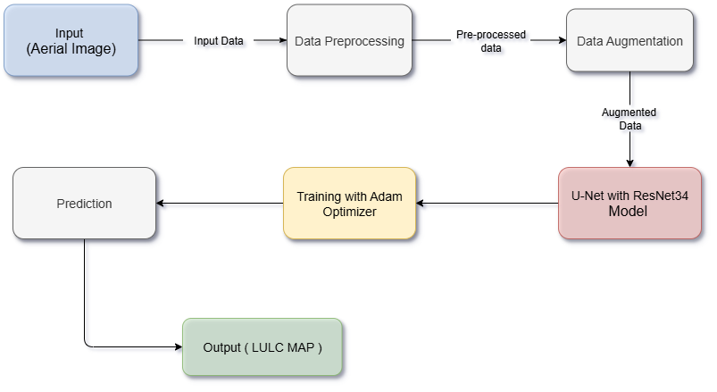

# LULC Semantic Segmentation with U-Net + ResNet34

[](https://www.python.org/) [](https://www.tensorflow.org/) [](https://opensource.org/licenses/MIT) []()

This project uses U-Net with a ResNet34 backbone to classify Land Use Land Cover (LULC) from satellite imagery, developed during my ISRO internship. It segments 4 classes (Background, Buildings, Woodlands, Water) and achieved a 0.84 Mean IoU on validation with batch evaluation, and 0.79 above on the full test dataset. Inspired by the idea of AI augmenting human geospatial insights, this work reflects a passion for technology that empowers.

 

## Overview
Built on the landcover.ai dataset, this project automates LULC mapping for urban planning and environmental monitoring. It handles 21k high-resolution images, patched to 256x256, with augmentation to tackle class imbalance.

- **Dataset**: [Explore the full dataset here](https://www.kaggle.com/datasets/adrianboguszewski/landcoverai) (70% train, 20% val, 10% test).
- **Training**: `notebooks/training_with_batch_evaluation.ipynb` trains the model and evaluates on batches.
- **Full Evaluation**: `src/final_lulc_evaluation.py` assesses the entire dataset.
- **Data Preparation**: `src/data_prep.py` patches and splits the data.

## Installation
```bash
git clone https://github.com/Faheem-02/LULC-Classification-U-Net-ResNet34.git
cd LULC-Classification-U-Net-ResNet34
pip install -r requirements.txt
